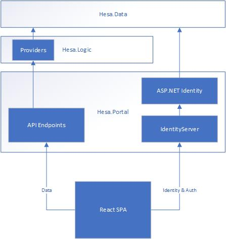

# HESA Code Test

> Code Test by Alistair Evans - 19/05/2020.

This solution provides a basic example of an SPA (single page application) that provides user search by last name, as well as
OIDC-based application identity.

## Running It

To run the project, you will need:

- NodeJS (v12+ preferable)
- The .NET Core 3.1 SDK (should be included with VS2019), including the ASP.NET Core components.

> The project runs on HTTPS, because OIDC defaults to using HTTPS-only cookies, and it's generally good practice. The SDK should automatically use the ASP.NET Core development certificate; if your development certificate isn't working you can find more info [here](https://docs.microsoft.com/en-us/aspnet/core/security/enforcing-ssl?view=aspnetcore-3.1&tabs=visual-studio#trust-the-aspnet-core-https-development-certificate-on-windows-and-macos) to get it working.

## Design and Approach

### Target and Packages

The server components all target .NET Core 3.1, with the C# 8 language version and Nullable Reference Types enabled. A `Directory.props` file in
the root of the solution controls the global language version and nullable option.

All new Microsoft stack projects should be built in .NET Core 3.1, at least until the .NET 5 release in Nov. 2020. It's cross-platform, fast, and easy to work with.

The main application UI is a React SPA, that authenticates using the `IdentityServer` library inside the Hesa.Portal process. This in turn hands off to the ASP.NET Core Identity system.

`IdentityServer` is the de-facto standard for OIDC on .NET Core, and the number one rule of OIDC is do not write it yourself!

I chose EF Core as the ORM, partly because it is the most straight-forward
approach to get ASP.NET Identity working. I've used it a lot in the past, and it has its upsides and downsides depending on the application. It's perfect for little apps like this one.

For the actual persistence store, I'm just using a simple SQL Lite file, which is suitable for my needs. This could be swapped out for a full DB instance in prod with relative ease.

### Solution Structure and Analysers

I laid out the solution the way I typically would for most projects; splitting into src and tests folders.

The exception is the presence of the LocalDB folder that contains the SQL Lite DB.

`Directory.props` files contain solution rules at each level, including the addition of what I consider the 'standard' set of project analyzers at the `src` level. Namely, the `Microsoft.CodeAnalysis.Analyzers`, `Microsoft.CodeAnalysis.FxCopAnalyzers` and `StyleCop.Analyzers` packages.

Some rules have been disabled, these are in the `.editorconfig` file.  I also use this file to enforce indentation rules.

There are a minimal set of tests in the Hesa.Logic.Tests project under `tests`; given more time, I'd aim for proper coverage throughout the app.

### Design

A quick layout diagram looks something like this:

I split the server-side components into three tiers:

- Data (Hesa.Data) - Defines database structures, and EF Context types.
- Logic (Hesa.Logic) - Exposes services for working with data (or performing other logic functions).
- Hosting server and API endpoint (Hesa.Portal) - Should be as simple as possible from a business logic perspective; generally should just map calls to/from the logic layer.

I've always found this sort of layout sensible; the front-end layer shouldn't call the data layer directly, it leads to intentional/accidental coupling.

From a front-end perspective, I used a React SPA because a) it's more interesting than straight-forward MVC posts and b) I wanted to show I could write some JS.

Most of the identity logic in the SPA comes from the template to power the various OIDC patterns, with a few customisations.

While the various webpack functionality provides a developer experience when you run it from Visual Studio, the production build compresses down, and can be served entirely from a static host or CDN if need be.

## Conclusions

### Time/Obstacles

Creating this solution took me a little over 4 hours; longer than initially specified. It was an interesting little project to spin up,
and I wanted to architect it in a way I was happy with and put in place the solution layout and analysers that I'd typically suggest. There was a brief challenge with the JWT Claim mapping; I'd forgotten that you needed to reset
the claim mappings with `JwtSecurityTokenHandler.DefaultInboundClaimTypeMap.Clear()` to make the roles work, which cost me some time.

ASP.NET Identity is very powerful, but occasionally infuriating.

### Potential Improvements

Given more time, there are some additional work I could do here. For example:

- Factor out the Identity Provider server process to be a seperate instance from the API process. My preferred application architecture for web apps now
  is to isolate the Identity Provider completely (so it could be replaced entirely with Auth0, Okta, or AzureFS) for any API components.
  I didn't do that here because it's more complicated to set up the OIDC set-up, and it would complicate the 'run with one click' requirement.

- Consider a different ORM; I picked EF Core here for simplicity, but I've had problems with it in large projects in the past, and would be interested in trying Dapper for non-identity work.

- Write more unit tests, particularly front-end tests. Would also add some integration tests (Selenium, Cypress, etc).
